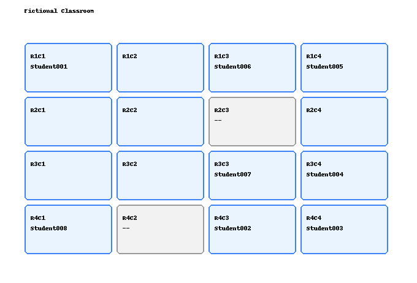

# 席序 SeatTrellis

[](https://github.com/FrankFu916/seattrellis/actions/workflows/tests.yml)

**简体中文 | [English](README.en.md)**

席序 SeatTrellis 是一个本地优先的课堂排座工具，用虚构示例数据展示可复现的座位安排流程。它可以生成单个 JSON snapshot，也可以一次生成多个带可解释评分的 candidate plans，并导出 Excel、PNG、HTML。

项目默认在本机处理数据。不要把真实学生名单、学号、成绩、班级、学校、座位偏好或历史座位快照提交到公开仓库。



## 快速开始

最小安装只安装核心模型、CLI 和 fallback solver：

```bash
python -m pip install -e .
seattrellis --help
seattrellis init-demo
seattrellis presets list
seattrellis presets show daily
seattrellis validate --students examples/students.csv --layout examples/classroom.json --preset daily --history-dir examples/history
seattrellis solve --students examples/students.csv --layout examples/classroom.json --preset daily --history-dir examples/history --output outputs/daily.snapshot.json
seattrellis project-info --project examples/project.seattrellis.json
seattrellis project-validate --project examples/project.seattrellis.json
seattrellis project-solve --project examples/project.seattrellis.json --candidates 3 --output outputs/project.candidates.json
seattrellis project-export --project examples/project.seattrellis.json --snapshot outputs/project.candidates.json --candidate recommended --format html --output outputs/project-recommended.html
seattrellis validate --students examples/students.csv --layout examples/classroom.json --rules examples/rules.json
seattrellis history-report --students examples/students.csv --layout examples/classroom.json --history-dir examples/history
seattrellis pair-report --students examples/students.csv --layout examples/classroom.json --history-dir examples/history
seattrellis solve --students examples/students.csv --layout examples/classroom.json --rules examples/rules_neighbor_avoidance.json --history-dir examples/history --output outputs/neighbor-aware.snapshot.json
seattrellis solve --students examples/students.csv --layout examples/classroom.json --rules examples/rules_multi_candidate.json --history-dir examples/history --candidates 5 --output outputs/candidates.json --report outputs/plan-report.json
seattrellis export --snapshot outputs/candidates.json --candidate recommended --format html --output outputs/recommended.html
seattrellis solve --students examples/students.csv --layout examples/classroom.json --rules examples/rules.json
seattrellis export --snapshot outputs/latest.snapshot.json --format html
```

导出文件会写入 `outputs/`。该目录已被 `.gitignore` 忽略。

## 安装层级

### 最小安装

```bash
python -m pip install -e .
seattrellis --help
```

最小安装支持 CLI help、CSV 输入、JSON layout/rules/snapshot/candidate set、内置规则 preset、本地 project workspace、deterministic fallback solver、多方案生成与评分，以及不依赖重库的 HTML 导出。

### 常用本地安装

```bash
python -m pip install -e ".[excel,image]"
```

适合 CSV/Excel 输入，以及 Excel、PNG、HTML 输出。

### 完整开发安装

```bash
python -m pip install -e ".[all,dev]"
pytest
```

`all` extra 包含 OR-Tools、Excel、PNG 和 Streamlit 相关依赖；`dev` extra 包含测试和构建工具。

### 网页端

```bash
python -m pip install -e ".[web,excel,image]"
streamlit run src/seattrellis/web/app.py
```

网页端依赖 Streamlit。若要在网页端上传 Excel 或下载 PNG/Excel，请同时安装 `excel` 和 `image` extras。

网页端支持选择内置 preset，也可以上传 rules JSON 作为覆盖；可上传多份历史 snapshot，生成 1–20 个候选方案，查看推荐方案、评分明细和 hard rule 检查，并下载 JSON、report、HTML、PNG 或 Excel。

## CLI

```bash
seattrellis --help
seattrellis init-demo --force
seattrellis presets list
seattrellis presets show daily
seattrellis presets export daily --output outputs/daily.rules.json
seattrellis validate --students examples/students.csv --layout examples/classroom.json --preset daily --history-dir examples/history
seattrellis solve --students examples/students.csv --layout examples/classroom.json --preset daily --history-dir examples/history --output outputs/daily.snapshot.json
seattrellis project-init --project examples/project.seattrellis.json --name "Demo Class" --students students.csv --layout classroom.json --rules rules_multi_candidate.json --history-dir history --outputs-dir outputs --candidates 5 --force
seattrellis project-info --project examples/project.seattrellis.json
seattrellis project-validate --project examples/project.seattrellis.json
seattrellis project-solve --project examples/project.seattrellis.json --candidates 3 --output outputs/project.candidates.json --report outputs/project-plan-report.json
seattrellis project-export --project examples/project.seattrellis.json --snapshot outputs/project.candidates.json --candidate recommended --format html --output outputs/project-recommended.html
seattrellis validate --students examples/students.csv --layout examples/classroom.json --rules examples/rules.json
seattrellis solve --students examples/students.csv --layout examples/classroom.json --rules examples/rules.json --output outputs/demo.snapshot.json
seattrellis solve --students examples/students.csv --layout examples/classroom.json --rules examples/rules.json --history-dir examples/history --output outputs/fair.snapshot.json
seattrellis solve --students examples/students.csv --layout examples/classroom.json --rules examples/rules_neighbor_avoidance.json --history-dir examples/history --output outputs/neighbor-aware.snapshot.json
seattrellis solve --students examples/students.csv --layout examples/classroom.json --rules examples/rules_multi_candidate.json --history-dir examples/history --candidates 5 --output outputs/candidates.json --report outputs/plan-report.json
seattrellis history-report --students examples/students.csv --layout examples/classroom.json --history-dir examples/history
seattrellis pair-report --students examples/students.csv --layout examples/classroom.json --history-dir examples/history
seattrellis export --snapshot outputs/demo.snapshot.json --format html --output outputs/demo.html
seattrellis export --snapshot outputs/candidates.json --candidate recommended --format html --output outputs/recommended.html
```

安装 `excel` 和 `image` extras 后，也可以运行：

```bash
seattrellis solve --students examples/students.xlsx --layout examples/classroom.json --rules examples/rules.json
seattrellis export --snapshot outputs/latest.snapshot.json --format excel
seattrellis export --snapshot outputs/latest.snapshot.json --format png
```

`init-demo` 默认不会覆盖已有示例文件；需要覆盖时使用 `--force`。最小安装会生成 CSV/JSON demo；安装 `excel` extra 后也会生成 `examples/students.xlsx`。旧命令名 `seatplanner` 仍作为兼容别名保留，新文档统一使用 `seattrellis`。

`presets list` 列出八种内置场景：`random`、`exam`、`daily`、`fair-rotation`、`neighbor-aware`、`balanced`、`height-aware`、`vision-friendly`。`presets show <name>` 展示 metadata 和生成的标准 rules JSON；`presets export <name>` 可写出普通 rules 文件。`solve` / `validate` 可以只使用 `--preset`，也可以同时传入 `--rules`：preset 作为基础，用户 JSON 中明确提供的字段递归覆盖 preset，hard rules 仍通过原有校验和求解路径绝对优先。缺少 history、score、height 或 vision 数据时会给出 warning，并只降级相关 soft rule / score 维度。

`project-init` 创建轻量的本地项目文件；`project-info` 检查配置和路径状态；`project-validate`、`project-solve`、`project-export` 分别复用现有校验、求解和导出逻辑。project 文件只保存相对路径和默认配置，不嵌入学生名单或座位数据；其中的相对路径始终相对于 project 文件所在目录解析。原有 `--students` / `--layout` / `--rules` 工作流继续可用。

`validate` 只检查输入文件和明显的规则冲突，不生成座位表；`solve` 会在校验通过后再生成 snapshot。错误信息会尽量指出文件、字段、行号和 hard-rule 冲突。使用 `--strict` 时，warning 也会让命令以非零退出码结束。

`solve` 可以通过 `--history` 多次传入历史 snapshot，也可以用 `--history-dir examples/history` 读取目录中的 `*.snapshot.json`。`history-report` 会基于当前学生名单、当前 layout 和历史 snapshot 输出每名学生的前排、后排、边侧、角落、靠窗、靠门、靠讲台、靠空调次数；加 `--output outputs/history-report.json` 可导出 JSON 报告。`pair-report` 会输出两两学生的历史同桌、横向、纵向、斜向、任意相邻和指定距离内次数；加 `--top 10` 可限制高频学生对展示数量，加 `--output outputs/pair-report.json` 可导出 JSON。

## 多方案与评分

`--candidates 1` 保持旧行为并写出普通 snapshot。`--candidates N` 会用同一组输入、确定性 seed 序列和“排除已生成完整 assignment”的约束重复求解，写出独立的 `kind: "candidate_set"` JSON。多方案生成是启发式流程，但每个候选仍必须通过全部 hard constraints；如果可行空间中没有足够多的不同方案，结果会保留已找到的方案并给出 warning。fallback 与 OR-Tools 后端都支持该排除机制。

candidate set 中每个方案包含 snapshot、seed、solver backend、总分、hard-constraint 摘要和评分 breakdown。当前可解释维度包括：

- `fair_rotation_score`：启用公平轮换且有历史时可用；
- `avoid_recent_neighbors_score`：启用关系回避且有 pair history 时可用；
- `score_balance_score`、`height_preference_score`、`vision_preference_score`：对应规则启用且输入字段足够时可用；
- `diversity_score`：候选之间 assignment 差异；
- `stability_score`：相对最近历史 snapshot 保持原座位的比例；
- `hard_constraint_summary`：固定座位、相邻/禁止相邻、最小距离和 assignment 完整性检查。

缺少历史、规则未启用或字段不足时，相关维度明确标记为 `not_available`，不会虚构分数。总分是可用维度按规则权重计算的 0–100 加权平均；推荐方案是在满足 hard constraints 的候选中总分最高者，同分时按 `candidate_id` 稳定排序。评分用于比较和解释，不代表全局最优。

普通 snapshot 与 candidate set 是两种不同格式，旧 snapshot 仍可读取。`export` 收到 candidate set 时默认导出 recommended candidate，也可以用 `--candidate candidate_03` 指定；HTML 会显示 candidate ID 和总分，Excel/PNG 仍由相应 extras 提供。

## 输入与规则

- 学生名单支持 CSV；安装 `excel` extra 后支持 `.xlsx` 和 `.xlsm`。旧版 `.xls` 请先另存为 `.xlsx` 或 CSV。
- 教室布局使用 JSON seat nodes，支持 `enabled=false` 的不可用座位。
- 规则文件分为 `hard` 和 `soft`。
- 内置 preset 生成同一种标准 rules JSON；它们不是新的求解器或规则格式。
- 未识别的规则字段会作为错误报告，避免拼写错误被静默忽略。
- `fair_rotation` 是基于历史座位类别次数的 soft rule；hard rules 仍然优先，无历史时不会报错。
- `avoid_recent_neighbors` 是基于历史同桌/相邻关系的 soft rule；fixed seats、必须相邻、禁止相邻、最小距离等 hard rules 仍然优先，无历史时不会报错。当前 fallback solver 和 OR-Tools solver 都把它作为启发式评分处理，不保证绝对最优。
- 详细格式见 [输入格式](docs/input-format.zh.md) 和 [规则说明](docs/rules.zh.md)。

## 求解器

默认使用内置 deterministic fallback solver，确保示例和小型排座流程无需重依赖即可运行。可选 OR-Tools CP-SAT 支持保留在 `solver` extra 中：

```bash
python -m pip install -e ".[solver]"
SEATTRELLIS_USE_ORTOOLS=1 seattrellis solve --students examples/students.csv --layout examples/classroom.json --rules examples/rules.json
```

只有设置 `SEATTRELLIS_USE_ORTOOLS=1` 时才会尝试导入 OR-Tools。若未安装 `solver` extra，CLI 会提示安装命令并以非零退出码结束。

## 当前支持

- CSV 学生名单导入，安装 `excel` extra 后支持 Excel 导入；
- JSON 教室布局、规则、snapshot、candidate set 和本地 project workspace；
- 八种可发现、可导出、可与用户 rules 叠加的场景 preset；
- seat nodes 和 adjacency graph；
- 固定座位、必须相邻、禁止相邻、最小距离；
- 视力靠前、高个靠后、随机扰动、邻座成绩偏好、公平轮换、近期同桌/相邻回避启发式偏好；
- 历史 snapshot 统计、`history-report` 本地公平性摘要和 `pair-report` 关系历史摘要；
- 多方案生成、可解释评分、comparison report 和 recommended candidate；
- 可移植的相对路径 project 配置，以及 `project-init` / `project-info` / `project-validate` / `project-solve` / `project-export`；
- HTML 导出，安装 `excel` / `image` extras 后支持 Excel / PNG 导出；
- 输入预检与冲突诊断、CLI、本地 Streamlit UI、虚构示例数据、pytest 和 GitHub Actions。

## 隐私说明

- `examples/` 只能包含虚构数据。
- `examples/history/` 只包含虚构历史 snapshot，用于演示公平轮换和关系历史回避。
- project 文件只保存路径和默认配置，不应嵌入或替代真实学生数据文件。
- `outputs/`、`exports/`、`snapshots/`、`private/`、`data/`、`real_students/`、`real_classes/` 和 `.env` 已被忽略。
- 分享 Issue、PR、截图、测试数据或历史座位记录前，请删除姓名、学号、成绩、备注、班级、学校和任何可识别信息。不要把真实历史座位 snapshot 提交到公开仓库。
- 不要把真实 candidate reports 或 candidate-set snapshots 提交到公开仓库；请只写入已忽略的 `outputs/` 等私有路径。

当前公平轮换和关系回避基于历史次数进行启发式评分，不保证绝对公平或绝对最优。

## 发布

当前稳定版本为 v0.2.3；发布检查见 [release checklist](docs/release-checklist.md)，变更见 [CHANGELOG.md](CHANGELOG.md)。

## 许可证

Apache License 2.0。详见 [LICENSE](LICENSE)。
