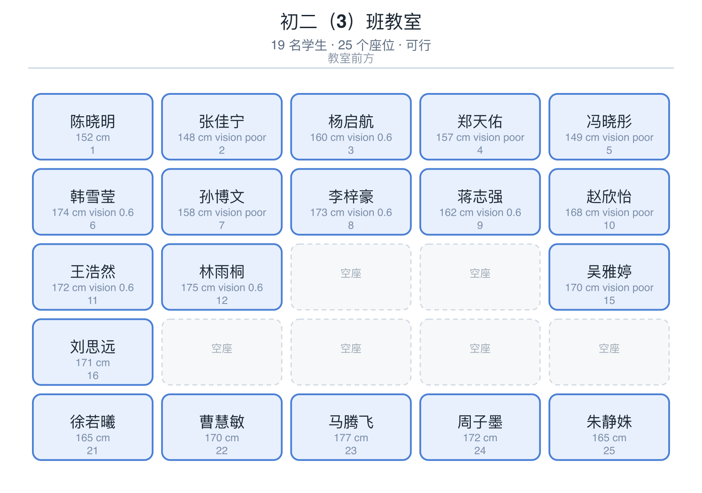

# 席序 SeatTrellis

[](https://github.com/FrankFu916/seattrellis/actions/workflows/tests.yml)

**简体中文 | [English](README.en.md)**

席序 SeatTrellis 是一个本地优先的课堂排座工具，用虚构示例数据展示可复现的座位安排流程。它可以生成单个 JSON snapshot，也可以一次生成多个带可解释评分的 candidate plans，并导出 HTML、Excel、PNG、PDF、Word、SVG、PPTX 和打印版 HTML。

项目默认在本机处理数据。不要把真实学生名单、学号、成绩、班级、学校、座位偏好或历史座位快照提交到公开仓库。



## 快速开始

```bash
python -m pip install -e .
seattrellis --help
seattrellis init-demo
seattrellis validate --students examples/students.csv --layout examples/classroom.json --preset daily --history-dir examples/history
seattrellis solve --students examples/students.csv --layout examples/classroom.json --preset daily --history-dir examples/history --output outputs/daily.snapshot.json
seattrellis export --snapshot outputs/daily.snapshot.json --format html
```

导出文件会写入 `outputs/`。该目录已被 `.gitignore` 忽略。

更多命令、场景和详细用法见 **[快速开始指南](docs/quickstart.zh.md)**。

## Rust 桌面版（紧凑分发预览）

项目已经确定采用 Rust-first 的桌面分发路线。`app/` 是不依赖 Python、Node.js
或 Streamlit 的本地 loopback 服务，`app/src-tauri/` 提供原生窗口；生产 React
资源会在构建时嵌入 Rust App，因此复制二进制到没有源码的目录也可以启动。

```bash
cargo build --release --locked --manifest-path app/Cargo.toml
app/target/release/seattrellis_app --open-browser
```

当前 Rust CLI 约 1.6 MiB，嵌入工作台的 App 约 2.7 MiB，Tauri 壳约 9 MiB（开发机
实测值，未签名）。Rust CLI 目前提供 `validate`、`solve` 和 `export`；Python CLI、Streamlit
兼容界面以及完整的项目/历史命令仍保留，直到 Rust 功能对拍和三平台安装验收完成。
迁移阶段和明确的发布门槛见 [Rust-first migration](docs/rust-migration.md)。

## 安装层级

### 最小安装

```bash
python -m pip install -e .
seattrellis --help
```

最小安装支持 CLI help、CSV 输入、JSON layout/rules/snapshot/candidate set、内置规则 preset、本地 project workspace、seeded fallback solver、多方案生成与评分，以及不依赖重库的 HTML 导出。

### 常用本地安装

```bash
python -m pip install -e ".[excel,image]"
```

适合 CSV/Excel 输入，以及 Excel、PNG、HTML 输出。

### 完整开发安装

```bash
python -m pip install -e ".[all,dev]"
pytest
```

`all` extra 包含 OR-Tools、Excel、PNG、PDF、Word 和 Streamlit 相关依赖；
`dev` extra 包含测试和构建工具，`e2e` extra 用于真实浏览器验收，`docs`
extra 用于构建文档站。需要制作桌面开发包时，再安装 `desktop-build` extra。

### React 工作台（推荐）

```bash
python -m pip install -e ".[web,excel,image]"
seattrellis workspace
```

`workspace` 命令会在本地启动 API 服务并自动打开浏览器工作台（默认地址
`http://127.0.0.1:8765`）。工作台使用 React 构建，面向普通教师提供一条清晰的
排座流程：

1. 上传 CSV 或 Excel 名单，自动识别字段映射（没有表头的常见导出也会保留第一行数据），
   预览增量或覆盖导入影响后确认；也可以
   直接在工作台中添加、删除或修正学生资料；
2. 选择教室模板，或按排数、列数、走廊和不可用座位设置自己的教室；需要异形布局时，
   可以直接打开可视化编辑器，把格子改成座位、走廊、讲台或空位；
3. 选择排座目标，同时勾选视力、身高、轮换、公平分布等常见偏好，
   添加“不要相邻”“必须相邻”或“固定座位”等要求；需要更精确控制时，
   在生成页展开“详细排座规则”，设置历史回看、邻座距离、成绩位置/均衡和互助搭档；
   也可以导入或下载完整 rules JSON，并选择多个历史 snapshot JSON；
4. 生成单期或未来多期方案，查看评分维度，手动调整座位并撤销/重做；
5. 导出为 HTML、Excel、PNG、PDF、Word、SVG 或 PPTX。

工作台右侧的“班级项目”面板还可以浏览本机最近项目的历史文件，执行分享前隐私
检查，并直接下载或恢复 `.seattrellis.zip` 备份；历史比较还可以展开查看匿名编号对应的
前后座位变化。生成多期轮换后选择班级项目，还可以把各期当前调整和操作记录保存为新的
轮换计划输出；历史输出中的轮换计划也可以重新载入并继续调整。教室的常见不规则布局和座位要求可以直接在普通流程中设置；需要完整
规则 JSON、layout JSON、历史 snapshot、候选数量、随机种子、时间限制或求解后端时，再展开生成页的“高级设置”。
详细规则面板只编辑已经接入求解、验证和评分的规则；常见的命名小组可以直接在普通
设置中配置“成员尽量相邻”或“成员保持分开”，更复杂的组关系仍可通过 JSON 兼容入口
补充，关系冷却也可以在详细面板中配置。
项目格式迁移会先显示不含原始值的字段变化、校验状态和备份/回退提示。
对已保存的轮换计划，项目面板还可以下载按期次整理的小组登记表，支持可打印 HTML 和 CSV，
并保留空组、未入座学生及名单中不存在的成员。

使用 `--no-open-browser` 可禁止自动打开浏览器，使用 `--host` 和 `--port`
可自定义监听地址。开发模式下可在 `clients/web/` 目录运行 Vite 开发服务器。

Python 桌面兼容原型可通过可选的 pywebview 壳启动：

```bash
python -m pip install -e ".[desktop]"
seattrellis desktop
```

该兼容壳和浏览器工作台共享同一套 React 资源与 Python 本地 API。制作可分发的 onedir
开发包需要：

```bash
python -m pip install -e ".[web,desktop-build]"
python scripts/build_desktop.py
```

桌面端会优先使用系统的打开/另存为对话框导入名单和保存导出文件；浏览器端仍使用
普通上传和下载。最近使用的名单只保存本机路径，不保存名单内容。旧版桌面包如果仍显示
`session_required` 或旧的英文导入界面，请退出旧进程后安装最新 release。

仓库已经提供 Tauri 安装包流水线（macOS `.app`/`.dmg`、Windows `.msi`/NSIS、Linux
`.deb`/AppImage），默认生成未签名产物并附加到已有 GitHub Release；运行方式见
`.github/workflows/tauri.yml`。Windows/macOS 代码签名、公证、干净机器安装和自动更新
仍在进行中；当前 Rust 构建是预览路径，尚未宣称替代 Python 的全部命令。

### Streamlit 网页端（兼容）

```bash
python -m pip install -e ".[web,excel,image]"
streamlit run src/seattrellis/web/app.py --server.address 127.0.0.1
```

Streamlit 网页端保留为兼容界面，适合需要直接查看完整配置的用户。它仍提供 preset、
rules overlay、历史目录、候选数量、seed、时间限制、backend 和导出隐私设置等文件级
选项；React 工作台则把常用设置收进渐进式“详细规则”和“高级设置”。新用户建议使用
`seattrellis workspace`，旧项目和复杂 JSON 配置不需要迁移或删除。

## CLI

```bash
seattrellis --help
seattrellis presets list
seattrellis presets show daily
seattrellis validate --students examples/students.csv --layout examples/classroom.json --preset daily --history-dir examples/history
seattrellis solve --students examples/students.csv --layout examples/classroom.json --preset daily --history-dir examples/history --output outputs/daily.snapshot.json
seattrellis export --snapshot outputs/daily.snapshot.json --format html
seattrellis project-rotate --project examples/project.seattrellis.json --periods 4
seattrellis project-pack --project examples/project.seattrellis.json --output class.seattrellis.zip
```

`project-rotate` 会按历史公平性逐期生成未来座位表，并输出重复邻座摘要。
`project-pack`、`project-restore` 和 `project-privacy` 用于本地备份、恢复和
分享前的敏感字段检查。

完整命令行用法、Project 工作流、多方案生成与评分见 **[快速开始指南](docs/quickstart.zh.md)**。

### Preset 与规则叠加

`presets list` 列出八种内置场景：`random`、`exam`、`daily`、`fair-rotation`、`neighbor-aware`、`balanced`、`height-aware`、`vision-friendly`。`solve` / `validate` 可以只使用 `--preset`，也可以同时传入 `--rules` 作为 overlay。缺少 history、score、height 或 vision 数据时会给出 warning 并自动降级相关 soft rule。

### Project 工作流

`project-init` 创建轻量的本地项目文件；`project-info`、`project-validate`、`project-solve`、`project-export` 分别复用现有校验、求解和导出逻辑。Project 文件只保存相对路径和默认配置，不嵌入学生名单。详见 [Project 工作流详解](docs/project.zh.md)。

### 历史分析

`solve` 支持 `--history` 或 `--history-dir` 加载历史 snapshot。`history-report` 输出每个学生的座位分类历史统计，`pair-report` 输出两两学生的同桌/邻座关系历史。详见 [快速开始指南](docs/quickstart.zh.md)。

导出支持 HTML 和打印版 HTML（无需 extras）、Excel（需 `excel` extra）、PNG（需 `image` extra）、PDF（需 `pdf` extra）、Word（需 `docx` extra）、SVG 和 PPTX（无需 extras）。打印 HTML、PDF、Word、SVG 和 PPTX 可选择 `public`、`teacher`、`report` 模板，设置字段隐藏、姓名匿名化、A4 横纵向、页面缩放和中英文内容。详见 [导出格式说明](docs/export.zh.md)。

## 多方案与评分

`--candidates N` 会生成 N 个不同方案，每个方案经过 7 维可解释评分（公平轮换、关系回避、成绩均衡、身高偏好、视力偏好、方案多样性、稳定性），选出最高分作为推荐方案。不可用的维度明确标记为 `not_available`，不虚构分数。

详细评分维度和使用说明见 **[快速开始指南 — 多方案评分维度](docs/quickstart.zh.md#多方案评分维度)**。

## 输入与规则

- 学生名单支持 CSV；安装 `excel` extra 后支持 `.xlsx` 和 `.xlsm`。旧版 `.xls` 请先另存为 `.xlsx` 或 CSV。
- 教室布局使用 JSON seat nodes，支持 `enabled=false` 的不可用座位。
- 规则文件分为 `hard` 和 `soft`。
- 内置 preset 生成同一种标准 rules JSON；它们不是新的求解器或规则格式。
- 未识别的规则字段会作为错误报告，避免拼写错误被静默忽略。
- `fair_rotation` 是基于历史座位类别次数的 soft rule；hard rules 仍然优先，无历史时不会报错。
- `avoid_recent_neighbors` 是基于历史同桌/相邻关系的 soft rule；fixed seats、必须相邻、禁止相邻、最小距离等 hard rules 仍然优先，无历史时不会报错。当前 fallback solver 和 OR-Tools solver 都把它作为启发式评分处理，不保证绝对最优。
- 详细格式见 [输入格式](docs/input-format.zh.md) 和 [规则说明](docs/rules.zh.md)。

## 求解器

默认使用内置 seeded fallback solver，确保示例和小型排座流程无需重依赖即可运行。它在完成固定尝试预算时，相同输入与 seed 会得到稳定结果；若墙钟时间限制提前终止求解（snapshot 中 `metrics.stopped_by_time_limit` 为 `true`），不同机器可能完成不同数量的尝试，因此最终方案不承诺逐字节一致。可选 OR-Tools CP-SAT 支持保留在 `solver` extra 中：

```bash
python -m pip install -e ".[solver]"
SEATTRELLIS_USE_ORTOOLS=1 seattrellis solve --students examples/students.csv --layout examples/classroom.json --rules examples/rules.json
```

只有设置 `SEATTRELLIS_USE_ORTOOLS=1` 时才会尝试导入 OR-Tools。若未安装 `solver` extra，CLI 会提示安装命令并以非零退出码结束。

## 当前支持

- CSV 学生名单导入，安装 `excel` extra 后支持 Excel 导入；
- JSON 教室布局、规则、snapshot、candidate set 和本地 project workspace；
- 八种可发现、可导出、可与用户 rules 叠加的场景 preset；
- seat nodes 和 adjacency graph；
- 固定座位、必须相邻、禁止相邻、最小距离；
- 视力靠前、高个靠后、随机扰动、邻座成绩偏好、公平轮换、近期同桌/相邻回避启发式偏好；
- 历史 snapshot 统计、`history-report` 本地公平性摘要和 `pair-report` 关系历史摘要；
- 多方案生成、可解释评分、comparison report 和 recommended candidate；
- 可移植的相对路径 project 配置，以及 `project-init` / `project-info` / `project-validate` / `project-solve` / `project-export`；
- HTML 与打印版 HTML 导出，安装对应 extras 后支持 Excel、PNG、PDF 和 Word 导出，SVG 和 PPTX 导出无需额外依赖；
- 成绩位置偏好、成绩均衡分布、师徒结对三类成绩排座目标，支持任意评分体系；
- React 浏览器工作台（`seattrellis workspace`），提供名单上传、字段映射、导入预览、排座生成、人工调整、项目备份和多种格式导出；
- 输入预检与冲突诊断、CLI、本地 Streamlit 兼容界面、虚构示例数据、pytest 和 GitHub Actions。

## 隐私说明

- `examples/` 只能包含虚构数据。
- `examples/history/` 只包含虚构历史 snapshot，用于演示公平轮换和关系历史回避。
- project 文件只保存路径和默认配置，不应嵌入或替代真实学生数据文件。
- `outputs/`、`exports/`、`snapshots/`、`private/`、`data/`、`real_students/`、`real_classes/` 和 `.env` 已被忽略。
- 分享 Issue、PR、截图、测试数据或历史座位记录前，请删除姓名、学号、成绩、备注、班级、学校和任何可识别信息。不要把真实历史座位 snapshot 提交到公开仓库。
- 不要把真实 candidate reports 或 candidate-set snapshots 提交到公开仓库；请只写入已忽略的 `outputs/` 等私有路径。

当前公平轮换和关系回避基于历史次数进行启发式评分，不保证绝对公平或绝对最优。

## 发布

当前稳定版本为 v1.8.4；发布检查见 [release checklist](docs/release-checklist.md)，变更见 [CHANGELOG.md](CHANGELOG.md)。

## 许可证

Apache License 2.0。详见 [LICENSE](LICENSE)。
