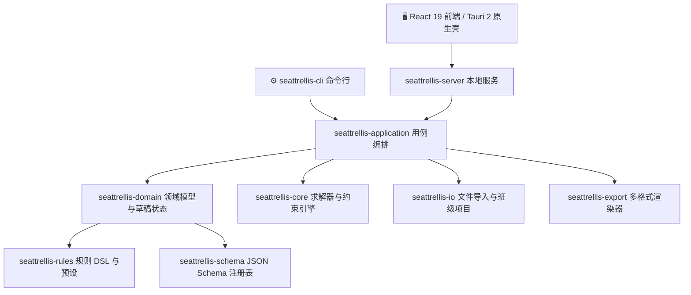

# 系统架构与模块设计

[English](architecture.md) · [简体中文](architecture.md)

**席序（SeatTrellis）v2.0.0** 采用纯 Rust 编写的核心引擎，遵循清晰的分层架构（Clean Architecture）与单向数据流设计。所有业务规则、约束校验、数据模型与求解算法均由 Rust 严谨管控；React 前端与 Tauri 2 桌面外壳仅作为交互与展示层，避免逻辑重复与状态漂移。

---

## 🏗️ 1. 系统分层与 Crates 职责划分

项目由 9 个解耦的 Rust Crate 协同构成：

### 核心 Crates 清单

| Crate 名称 | 职责定位 | 核心能力 |
| :--- | :--- | :--- |
| `seattrellis-schema` | **协议与模式契约** | 定义所有 v2 产物（快照、候选集、项目清单）的强类型 Schema 与版本注册表。 |
| `seattrellis-rules` | **规则 DSL 与预设** | 规则配置解析、14 种开箱即用场景预设、软规则权重管理。 |
| `seattrellis-domain` | **领域核心实体** | 交互式微调草稿状态机、排座时段轮换模型、小组拓扑关系。 |
| `seattrellis-core` | **算法与求解核心** | 基于图论与回溯约束满足的高性能求解器、局部搜索、多候选生成及雷达评分。 |
| `seattrellis-io` | **数据导入与项目 I/O** | 零依赖 CSV/Excel 解析器、项目生命周期管理、打包备份与旧版迁移。 |
| `seattrellis-export` | **渲染与排版引擎** | 8 种格式原生导出（HTML/SVG/PNG/PDF/Word/Excel/PPTX）与字体光栅化。 |
| `seattrellis-application` | **业务用例编排** | 串联导入、预检、求解、多候选对比、局部修复与导出的应用服务。 |
| `seattrellis-server` | **本地传输与静态托管** | 基于 Tokio/Axum 的本地回环 HTTP 服务，内置前端静态资源打包与安全网关。 |
| `seattrellis-cli` | **命令行接入层** | 27 个子命令的参数解析、环境诊断与标准输出渲染。 |

---

## 🔒 2. 本地通信与安全防护边界

1. **回环绑定与 DNS 重新绑定防护**：
   本地服务默认仅监听 `127.0.0.1:8765`。所有 HTTP 请求必须携带有效的 `Host: 127.0.0.1:*` 头部，防止恶意网页通过 DNS Rebinding 攻击探测本地数据。
2. **256 位会话令牌（Session Token）**：
   服务启动时在内存生成随机强密钥，除会话引导端点外，所有 API 均需携带 `Authorization: Bearer <token>` 认证。
3. **同源保护与严格 CSP**：
   全站强制启用 `Same-Origin` 校验、`X-Frame-Options: DENY` 以及无外链的 `Referrer-Policy: no-referrer`。

---

## ⚡ 3. 交互式编辑器协议（Editor Protocol）

为了在 Web、桌面和 CLI 之间保持完全一致的手工微调体验，系统采用了基于命令模式的统一编辑协议（`protocol_version: "1.0"`）：
- **草稿标识与单调版本号**：每个编辑会话拥有唯一的 `draft_id` 与自增版本号（`revision`），杜绝并发写入冲突；
- **原子化操作与撤销**：批量操作被打包为单个原子命令，支持一步完整撤销（Undo）或重做（Redo）；
- **即时约束合规诊断**：任何位置改动后，Rust 后端会立即对当前座位图执行硬约束复核并返回违规状态。

---

## 📖 相关文档

- [CLI 参考手册](cli.md)
- [REST API 接口文档](api.md)
- [本地隐私白皮书](privacy.md)
- [开发与测试指南](development.md)
