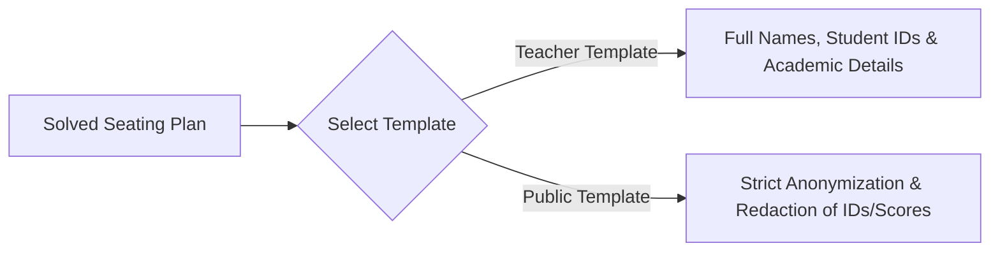

# Export Formats & Printing Guide

[English](export.md) · [简体中文](export.zh.md)

**SeatTrellis v2.0.0** includes a high-performance, native Rust rendering pipeline. Export seating arrangements in milliseconds to vector graphics, raster images, office documents, and print-ready sheets without external dependencies on Microsoft Office, LibreOffice, Python, or browser headless runtimes.

---

## 🖨️ 1. Eight Supported Export Formats

| Format | Identifier | Description & Recommended Use Cases |
| :--- | :--- | :--- |
| **Print-Ready Web Page** | `print-html` | Optimized for single-page A4 printing with dynamic typography, podium markers, and aisle spacing (via `project-export` or Web Workbench). |
| **Interactive Web Page** | `html` | Standalone, self-contained HTML file viewable on any browser or mobile device. |
| **Vector Seating Map** | `svg` | Fully scalable vector graphic ideal for posters, large displays, or secondary graphic editing. |
| **High-Resolution Image** | `png` | Anti-aliased raster image using local OS fonts, perfect for instant messaging or digital sharing. |
| **PDF Document** | `pdf` | Single-page document with rasterized text to guarantee pixel-perfect layout across all printers. |
| **Excel Workbook** | `xlsx` | Multi-tab workbook containing the visual seating grid and a structured student assignment roster. |
| **Word Document** | `docx` | Native table document ready for formatting adjustments, notes, or administrative compilation. |
| **PowerPoint Slide** | `pptx` | 16:9 presentation slide composed of native vector shapes for classroom projector displays. |

---

## 🔒 2. Dual Templates & Privacy Redaction

SeatTrellis enforces a clear boundary between **internal administrative records** and **public classroom postings**:



### Teacher Internal Template (`--template teacher`, Default)
- Displays complete student names, student IDs, and assigned desk coordinates.
- Suitable for attendance, grading, classroom management, and internal record-keeping.

### Public Classroom Template (`--template public`)
- **Automated Anonymization**: Student names are replaced with anonymous labels (e.g., "Student 01").
- **Strict Data Suppression**: Completely omits student IDs, academic scores, height records, and vision notes.
- **Fail-Closed Privacy Guarantee**: Public templates strictly refuse to loosen redactions, ensuring no sensitive data is leaked when charts are posted on classroom walls.

---

## 💻 3. CLI Export Instructions

### 3.1 Basic Export Commands

```bash
# 1. Export as a high-resolution PNG image (Teacher Copy)
seattrellis export \
  --problem problem.json \
  --solution plan.json \
  --format png \
  --output outputs/plan.png

# 2. Export as an anonymized public HTML page
seattrellis export \
  --problem problem.json \
  --solution plan.json \
  --format html \
  --template public \
  --output outputs/public_plan.html
```

> 📌 **Constraint Revalidation**: `export` independently re-validates the solution against all hard constraints before rendering. **Invalid or non-solved inputs are strictly refused.**

---

### 3.2 Project Export Commands (`project-export`)

In project-based workflows, `project-export` renders pre-computed plans and **never incurs solver computation**:

```bash
# Export a specific candidate plan as an A4 landscape print sheet
seattrellis project-export \
  --project my-class/seattrellis.project.json \
  --snapshot outputs/candidates.json \
  --candidate candidate_02 \
  --format print-html \
  --template public \
  --orientation landscape \
  --output outputs/class_wall.html
```

### Layout Options:
- `--template <teacher|public>`: Choose between teacher administrative view (default) and public anonymized view.
- `--orientation <portrait|landscape|auto>`:
  - `auto` (default): Automatically sets `print-html` to A4 Landscape, while other document formats default to Portrait.
  - `landscape` / `portrait`: Explicitly overrides page orientation.

---

## 📐 4. Print Layout & Typography Strategy

1. **A4 Fit-to-Page Layout**: The `print-html` template measures the longest student name in the roster and classroom dimensions, calculating optimal font sizes and cell margins to guarantee clean single-page printing.
2. **Local Font Rasterization**: PNG and PDF exports discover and rasterize system fonts locally at export time. For details on CJK font support, see the [Font Strategy Guide](font-strategy.md).

---

## 📖 Related References

- [Quick Start Guide](quickstart.md)
- [Web Workbench Guide](web.md)
- [Font Strategy Guide](font-strategy.md)
- [Class Project Workflow](project.md)
