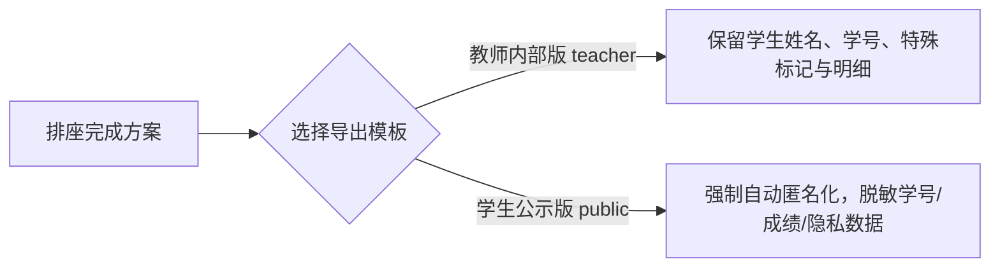

# 多格式导出与排版打印指南

[English](export.md) · [简体中文](export.zh.md)

**席序（SeatTrellis）v2.0.0** 内置全套由纯 Rust 实现的本地渲染器。无需依赖 Microsoft Office、WPS、浏览器环境或 Python 脚本，即可毫秒级生成高质量矢量图、高清位图、可编辑办公文档及打印专用排版。

---

## 🖨️ 1. 八种支持格式一览

| 导出格式 | 标识符 | 特点与适用场景 |
| :--- | :--- | :--- |
| **打印专用网页** | `print-html` | 专为 A4 打印优化，默认横向，自适应字号，带有讲台朝向与走道分隔（通过 `project-export` 或 Web 端导出）。 |
| **交互式网页** | `html` | 单文件自包含 HTML，可在任何浏览器中直接打开与查看。 |
| **矢量座位图** | `svg` | 独立 SVG 矢量图，适合二次编辑、海报设计或高清投影。 |
| **高保真图片** | `png` | 本机字体抗锯齿光栅化渲染，方便微信/钉钉群分发。 |
| **PDF 文档** | `pdf` | 标准单页文档，文字精准光栅化，在任何打印机上均可呈现一致的版面效果。 |
| **Excel 工作簿** | `xlsx` | 包含“网格座位图”与“学生名单对照表”双工作表，方便教务存档与二次统计。 |
| **Word 文档** | `docx` | 原生表格排版，支持在 Word 中直接修改格式、字体或添加备注。 |
| **PowerPoint 幻灯片** | `pptx` | 16:9 标准比例单页幻灯片，座位均为独立矢量形状，可直接用于多媒体班会展示。 |

---

## 🔒 2. 双重导出模板与隐私脱敏

系统严格区分**教师内部使用**与**班级公开公示**两大场景：



### 教师内部版（`--template teacher`，默认）
- 完整显示学生真实姓名、学号与座次位置；
- 供班主任、任课教师课堂点名、考勤及日常管理使用。

### 班级公示版（`--template public`）
- **自动隐私脱敏**：将姓名替换为脱敏编号（如“学生 01”或局部遮蔽）；
- **强制隐藏敏感字段**：绝不展示学号、身高、视力要求、学业成绩或教师内部备注；
- **安全底线保障**：公示版采用“安全闭环（Fail-Closed）”机制，任何外部参数均无法绕过脱敏策略。

---

## 💻 3. 命令行导出操作指南

### 3.1 基础导出命令

```bash
# 1. 导出为高清晰度 PNG 图片（教师内部版）
seattrellis export \
  --problem problem.json \
  --solution plan.json \
  --format png \
  --output outputs/plan.png

# 2. 导出为学生公开公示版 HTML
seattrellis export \
  --problem problem.json \
  --solution plan.json \
  --format html \
  --template public \
  --output outputs/public_plan.html
```

> 📌 **严格合规校验**：`export` 在渲染前会调用独立校验器对方案进行二次复核，**绝不会导出任何违反硬约束的残缺或无效方案**。

---

### 3.2 班级项目导出命令（`project-export`）

在项目工作流中，`project-export` 直接渲染已保存的方案或候选集快照，**绝不耗费算力重复求解**：

```bash
# 导出指定的候选方案为 A4 横向打印版
seattrellis project-export \
  --project my-class/seattrellis.project.json \
  --snapshot outputs/candidates.json \
  --candidate candidate_02 \
  --format print-html \
  --template public \
  --orientation landscape \
  --output outputs/class_wall.html
```

### 版面控制参数：
- `--template <teacher|public>`：选择教师内部版（默认）或班级公示版。
- `--orientation <portrait|landscape|auto>`：
  - `auto`（默认）：`print-html` 自动采用 A4 横向（Landscape），其余文档默认采用纵向（Portrait）；
  - `landscape` / `portrait`：强制指定纸张方向。

---

## 📐 4. 打印排版细节与字体策略

1. **A4 纸张自适应算法**：`print-html` 模板会根据当前班级中最长学生姓名与教室列数，动态计算最优字号与单元格间距，确保 100% 容纳在一页 A4 纸内，避免跨页断行。
2. **本地字体光栅化**：PNG 和 PDF 导出在生成时自动搜寻并加载操作系统的中文字体（如苹方、微软雅黑、思源黑体等）。详情请参考 [中文字体策略](font-strategy.zh.md)。

---

## 📖 相关参考

- [快速上手指南](quickstart.zh.md)
- [Web 与桌面工作台指南](web.zh.md)
- [中文字体策略](font-strategy.zh.md)
- [班级项目工作流](project.zh.md)
