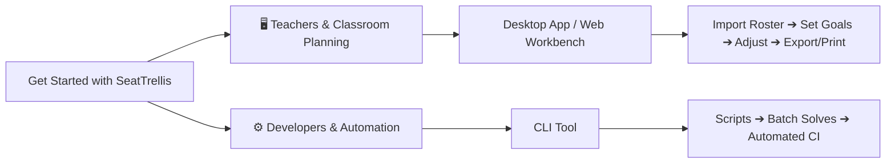

# SeatTrellis Documentation Center

[English](index.md) · [简体中文](index.zh.md)

**SeatTrellis** is a privacy-first, local-first intelligent classroom seating planner. Whether for routine semester rotations, academic peer-tutoring, or standardized test layouts, SeatTrellis generates scientifically sound, fair, and fully explainable seating arrangements in seconds.

Built entirely in Rust, version 2.0.0 delivers a native desktop app, a lightweight local web workbench, and a versatile CLI tool. It runs completely offline without requiring Python, Node.js, or any external runtimes.

---

## 🎯 Choose Your Entry Point

- **🖥️ Desktop Application (Recommended for Teachers)**: Powered by Tauri 2, providing a native OS window, wizard-guided workflow, and rich interactive seating adjustment tools.
- **🌐 Web Workbench**: Start a lightweight, loopback-only React workbench in your browser with a single command.
- **⚙️ CLI Tool (Recommended for Power Users & Automation)**: Offers 27 robust subcommands for batch validation, solving, multi-candidate generation, history analysis, and export pipelines.

---

## 📚 Documentation Sitemap

### 1. Getting Started & User Guides
- **[Quick Start Guide](quickstart.en.md)**: Install, validate, solve your first seating problem, and export the chart in 5 minutes.
- **[Web & Desktop Workbench Guide](web.en.md)**: Master roster imports, classroom layout design, drag-and-drop swaps, locking, and undo/redo.
- **[Export & Printing Guide](export.zh.md)**: 8 export formats (PDF, PNG, Word, Excel, etc.), print layout optimization, and student privacy redaction.
- **[Class Project Workflow](project.zh.md)**: Long-term class records, multi-term rotation schedules, packaging, and backup restoration.

### 2. Rules & Data Specifications
- **[Rule Handbook](rules.en.md)**: In-depth reference for hard constraints (fixed seats, required/forbidden pairs) and soft preferences (vision, height, academic mixing, fair rotation, neighbor avoidance).
- **[Input Formats & Schemas](input-format.en.md)**: Specifications for student rosters (CSV), classroom layouts (JSON), snapshots, and historical records.
- **[Scenario Presets Reference](presets.md)**: 14 out-of-the-box classroom templates (daily teaching, exams, study pairs, etc.).
- **[Font Rendering Strategy](font-strategy.zh.md)**: Cross-platform font fallback mechanisms for consistent typography.

### 3. Advanced References & Internals
- **[CLI Reference Manual](cli.md)**: Complete coverage of all 27 subcommands, options, and frozen exit codes.
- **[Scoring & Objective Breakdown](scoring.md)**: Multi-dimensional scoring mechanism, `not_available` state handling, and radar metrics.
- **[Multi-Candidate Generation](candidates.md)**: Generating distinct candidate plans with diversity and stability metrics.
- **[Historical Rotation](history.md)** & **[Neighbor Avoidance](pair-history.md)**: Long-term fairness algorithms preventing repeated seat types or partner monotony.
- **[Troubleshooting & FAQ](troubleshooting.md)**: Resolving constraint conflicts, infeasible problems, and diagnosing environments.

### 4. Architecture, Engineering & Compliance
- **[System Architecture](architecture.md)**: Layered design across 9 core Rust crates and data flow.
- **[Privacy & Local Security](privacy.md)**: Local processing boundaries, zero-telemetry policy, and sensitive data protection.
- **[Upgrading from v1 (Python)](rust-migration.md)**: Smooth migration steps for legacy project files.
- **[Developer & Testing Guide](development.md)**: Local build instructions, test suites, and performance benchmark gates.

---

## ⚖️ Core Engineering Principles

1. **Hard Constraints Always Prevail**: Any plan marked *Solved* is guaranteed to satisfy all hard constraints. The solver never violates a rule to improve a preference score.
2. **Deterministic & Reproducible**: With a pinned random seed and no timeout cutoffs, seating solutions are 100% reproducible across machines and runs.
3. **Honest Scoring**: When required data is missing (e.g., no historical records), the affected scoring dimension is marked `not_available` rather than faking a baseline score.
4. **Local-First Privacy**: No telemetry, no accounts, and no data uploads. All processing happens entirely within your machine's local memory and disk.
5. **Rigorous Exit Semantics**: If the search budget is exhausted without mathematical proof of infeasibility, the system reports `Unknown` rather than fabricating an `Infeasible` verdict.
