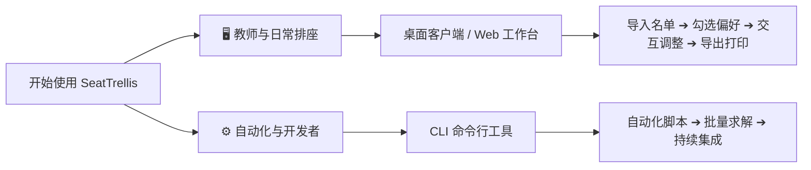

# 席序（SeatTrellis）文档中心

[English Docs](index.md) · [简体中文](index.zh.md)

**席序（SeatTrellis）** 是一款专注于隐私保护、本地运行的智能课堂排座系统。无论是日常班级轮换、分层教学互助，还是标准化考场布局，席序都能基于数学约束与多维教学偏好，秒级输出科学、公平且完全可解释的座位方案。

v2 版本采用高性能纯 Rust 核心重构，提供原生桌面端、本地 Web 工作台与 CLI 命令行工具，无需安装 Python、Node.js 等任何外部运行时，真正做到**开箱即用、完全离线**。

---

## 🎯 快速选择您的使用方式

- **🖥️ 桌面客户端（推荐教师使用）**：基于 Tauri 2 构建，拥有原生系统窗口与高分辨率渲染，内置向导式操作面板与可视化座位微调工具。
- **🌐 Web 工作台**：只需一条命令即可在浏览器中开启纯本地的 React 工作台，兼具灵活性与易用性。
- **⚙️ CLI 命令行工具（推荐进阶与自动化）**：提供 27 个功能完备的子命令，支持批量校验、算法求解、历史分析、局部修复与多格式导出。

---

## 📚 文档全景导航

### 1. 入门与日常操作
- **[快速上手指南](quickstart.zh.md)**：5 分钟完成安装、预检、求解与第一次座位表导出。
- **[Web 与桌面工作台指南](web.zh.md)**：名单导入、教室布局绘制、拖拽换座、锁定与撤销重做详解。
- **[多格式导出与排版打印](export.zh.md)**：8 种导出格式（PDF/PNG/Word/Excel等）、A4 打印优化与学生公示脱敏策略。
- **[班级项目管理工作流](project.zh.md)**：长期班级档案管理、学期轮换计划、项目备份与恢复。

### 2. 规则与数据规范
- **[排座规则配置手册](rules.zh.md)**：深入理解硬约束（固定位/必相邻/禁相邻）与软偏好（视力/身高/成绩/轮换/邻座回避）。
- **[输入数据与 Schema 规范](input-format.zh.md)**：学生名单 CSV、教室布局 JSON、快照文件及历史记录的完整规范。
- **[开箱即用场景预设清单](presets.md)**：日常教学、期中考试、互助搭档等 14 种预设场景。
- **[中文字体渲染策略](font-strategy.zh.md)**：跨平台高保真字体回落机制与排版效果保障。

### 3. 进阶参考与系统原理
- **[CLI 命令行完全参考手册](cli.md)**：所有子命令参数、诊断输出及退出码语义规范。
- **[多维度评分与加权机制](scoring.md)**：方案评分体系、不可用（`not_available`）判定与雷达图指标。
- **[多候选方案生成与对比](candidates.md)**：候选方案生成原理、多样性与稳定性度量。
- **[历史轮换与同桌追踪](history.md)** & **[邻座回避机制](pair-history.md)**：长期班级座次公平性保障算法。
- **[常见问题与故障排查](troubleshooting.md)**：约束冲突定位、求解无解排查与环境自检。

### 4. 架构、开发与合规
- **[系统架构与分层设计](architecture.md)**：9 个核心 Crate 的职责划分与数据流转。
- **[本地隐私与数据安全白皮书](privacy.md)**：本地运行边界、无遥测声明与敏感信息扫描。
- **[从 v1 (Python) 升级指南](rust-migration.md)**：旧版项目向 v2 的平滑迁移步骤。
- **[开发者贡献与测试指南](development.md)**：本地构建、测试套件与性能基准测试。

---

## ⚖️ 核心设计原则

1. **硬约束具有绝对优先级**：任何标记为“已解决（Solved）”的方案必须 100% 满足所有硬约束，绝不为提高偏好得分而违背底线。
2. **算法结果可严谨复现**：固定随机种子（Seed）且未触发超时截断时，任何时刻、任何机器上的求解结果完全一致。
3. **真实诚实的评分体系**：当缺少计算某种偏好所需的数据（如缺失历史记录或成绩）时，该维度明确标记为 `not_available`，绝不虚构基准分。
4. **零侵扰的数据隐私底线**：默认不联网、不上报、不收集任何遥测日志，学生名单与成绩仅存在于您本机的临时内存和本地文件中。
5. **严谨的状态机与退出语义**：算力耗尽或无法证明无解时输出 `Unknown`，绝不把“未找到”伪装成“数学上证明不可行（ProvenInfeasible）”。
