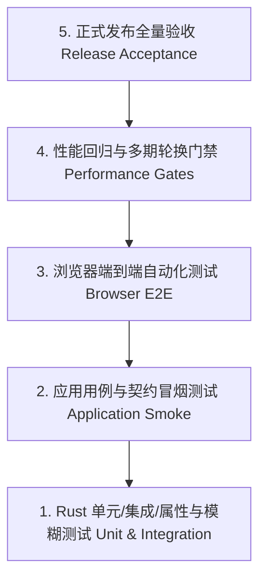

# 测试与质量保障规范（Testing & Acceptance）

[English](testing.md) · [简体中文](testing.md)

**席序（SeatTrellis）** 建立了金字塔型的 5 层全方位质量保障体系：Rust 单元/集成测试、应用冒烟测试、浏览器端到端测试（E2E）、性能回归门禁与发布验收测试。

---

## 🧪 1. 五层测试架构



---

## 💻 2. 本地测试执行指南

### 2.1 单元与集成测试
```bash
# 运行全部 690+ 项 Rust 单元与集成测试
cargo test --locked --workspace

# 运行前端 160+ 项 React/Vitest 测试
cd clients/web && npm test -- --run && cd ../..
```

### 2.2 契约与静态一致性检查
```bash
# 检查 OpenAPI 文档与前端 TypeScript 类型契约是否同步
cargo run -p xtask -- contract check

# 检查代码仓库整洁性与运行时纯度
python3 scripts/check_repository_hygiene.py
python3 scripts/check_no_python_runtime.py --tree --expect-retired
```

### 2.3 性能门禁与长周期压力测试
```bash
# 求解器 40/50/60/80 人基准耗时检查
cargo build --release --locked -p seattrellis
python3 scripts/bench_solver.py --check

# 多候选生成与多期长周期轮换压力测试
cargo test --release --locked -p seattrellis_core --test candidates_gate --test long_run_gate -- --ignored
cargo test --release --locked -p seattrellis-application --test rotation_gate -- --ignored
```

---

## 📖 相关文档

- [开发指南](development.md)
- [性能基准测试规范](benchmarks.md)
- [版本发布核对清单](release-checklist.md)
