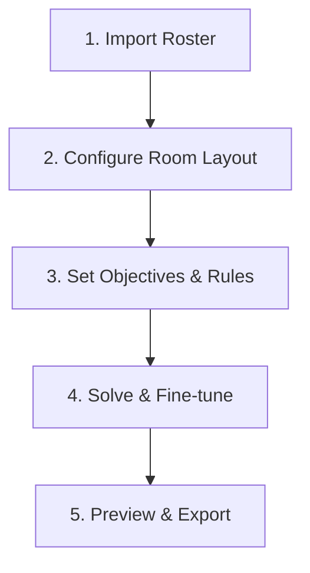

# Web & Desktop Workbench Guide

[English](web.md) · [简体中文](web.zh.md)

**SeatTrellis** offers a modern interactive workbench designed for educators and administrators. Built with React 19 and driven by a local Rust backend, it delivers a responsive, local-first seating arrangement workflow without external cloud dependencies.

---

## 🖥️ 1. Launching the Workbench

### Desktop Application (Recommended)
Simply launch the desktop app (powered by Tauri 2). The native shell starts the lightweight core service in the background and renders the workbench in an integrated native window.

### Web Browser Mode
Start the local server bound exclusively to `127.0.0.1:8765`:

```bash
# Launch the server and automatically open the workbench in your default browser
seattrellis_web --open-browser

# Or from source code during development
cargo run -p seattrellis_web -- --open-browser
```

> 🔒 **Local Security Assurance**:
> Upon launch, a secure 256-bit session token is generated. The server binds strictly to the loopback interface (`127.0.0.1`), ensuring zero exposure to local networks or external hosts.

---

## 🧭 2. The 5-Step Seating Wizard

The workbench provides an intuitive, step-by-step workflow tailored for teachers:



### Step 1: Import Student Roster
- **File Formats**: Upload `.csv`, `.xlsx`, or `.xlsm` rosters with drag-and-drop.
- **Smart Column Detection**: Automatically maps columns for Name, Student ID, Gender, Height, Vision Needs, and Academic Scores. Rosters with names only or lacking headers can proceed directly.
- **Inline Editing**: Add, update, or correct student profiles directly within the table editor.

### Step 2: Configure Room Layout
- **Standard Templates**: One-click setups for 30-, 48-, or 60-seat classrooms.
- **Custom Grids**: Adjust rows, seats per row, aisle placements, and podium orientation.
- **Irregular Rooms**: Click on grid cells to disable them or mark aisles and empty spaces.

### Step 3: Set Objectives & Rules
- **Preset Scenarios**: Toggle between Daily Routine, Quick Shuffle, or Mentorship Pairing.
- **Preferences**: Select front-row vision priority, ascending height ordering, academic score balancing, and room-zone rotation.
- **Hard Constraints**: Enforce fixed desk assignments, required/forbidden neighbor pairs, and minimum testing distances.

### Step 4: Solve & Interactive Fine-Tuning
- **Sub-second Solving**: Generates mathematically verified seating arrangements accompanied by radar score breakdowns.
- **Candidate Comparison**: Compare multiple candidate plans side-by-side with diversity and stability metrics.
- **Visual Swapping & Dragging**:
  - Click on one student, then click another to **swap their seats instantly**.
  - Click on a student, then click an empty desk to **move them**.
  - Full **Undo** and **Redo** history for all actions.
- **Lock & Local Repair**:
  - Click the lock icon on specific seats to hold those students in place.
  - Run **Local Repair** on remaining unlocked students to rebalance the room while respecting all constraints.

### Step 5: Preview & Export
- **Dual Export Templates**:
  - **Teacher Copy**: Includes full names, IDs, special accommodation flags, and scores.
  - **Public Posting Copy**: Automatically anonymizes sensitive student IDs and academic metrics for privacy compliance.
- **Format Support**: Export to PNG images, PDF documents, editable Excel (XLSX), Word (DOCX), PowerPoint (PPTX), and print-optimized HTML.

---

## 📅 3. Multi-Period Fair Rotation

For classes that rotate seating on a weekly, monthly, or semester basis:

1. Specify the number of future periods in the generation step (e.g., generate 4 periods).
2. Each period produces an independent snapshot and editing draft.
3. The solver computes overall **desk-mate repetition rates** and **zone distribution balance** across all periods.
4. The **History & rotation → Rotation plan** view provides a seat-movement heatmap across the full generated sequence. It shows seat-occupant changes, calculates adjacent-period movement distances when both seat IDs can be resolved in the current layout, and summarizes the results. Unresolved seat changes still count as moves, with distance marked unavailable.
5. Occupant changes come from snapshots created during that generation run, while grid distances use the current layout coordinates. Manual fine-tuning of the selected period updates only its editing draft; it does not update the heatmap or write the change back into the generated period snapshots.
6. Save the full rotation sequence directly into your class project or export group rosters.

---

## 🎒 4. Class Project Panel

Open the **Class Project** panel in the sidebar for long-term class management:

| Feature | Description |
| :--- | :--- |
| **Local Project Discovery** | Scans designated local directories for `*.project.json` files and displays class histories. |
| **Plan Diff & Comparison** | Compare two historical arrangements to track seat movements and partner changes. |
| **One-Click Backup** | Package rosters, layouts, rules, and history files into a portable `.seattrellis.zip` bundle. |
| **Cross-Machine Restore** | Restore project bundles onto any other machine with a single click. |
| **Privacy Compliance Audit** | Scans project files for unredacted sensitive identifiers prior to external sharing. |

---

## ♿ 5. Accessibility & Ergonomics

- **Keyboard Navigation**: Use `Tab` to navigate through import, configuration, solving, and export controls with high-contrast focus outlines.
- **Responsive Layout**: Adapts gracefully to compact screens with touch targets exceeding 44px.
- **Instant Language Switching**: Toggle between Simplified Chinese and English seamlessly without losing current working state.
