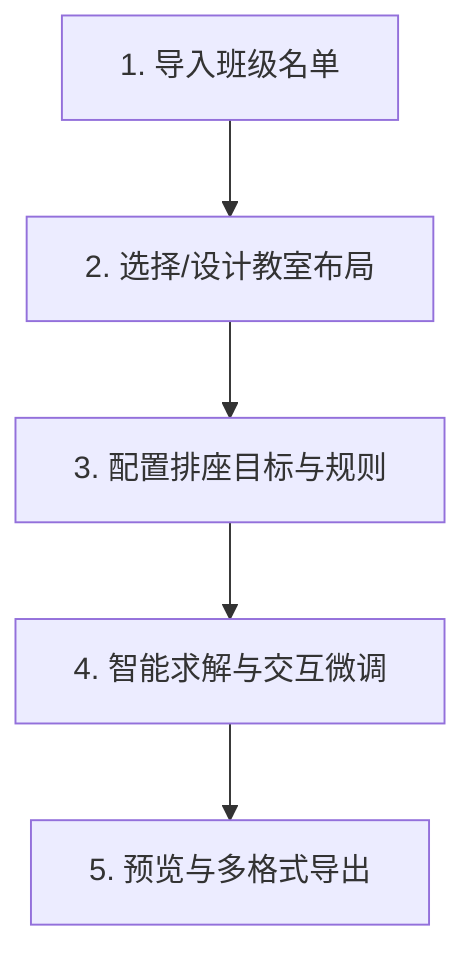

# Web 与桌面工作台使用指南

[English](web.md) · [简体中文](web.zh.md)

**席序（SeatTrellis）** 提供基于 Web 与桌面原生环境的现代化排座工作台。前端采用 React 19 构建，后端由纯 Rust 本地服务驱动，为您带来流畅、安全、零云端依赖的交互式排座体验。

---

## 🖥️ 1. 启动工作台

### 桌面版客户端（推荐）
直接双击打开桌面应用（基于 Tauri 2 构建）。桌面端会在本地系统后台启动轻量核心服务，并在独立的原生窗口中加载工作台。

### Web 浏览器模式
通过命令行启动仅绑定本地回环地址（`127.0.0.1:8765`）的本地服务：

```bash
# 启动服务并在默认浏览器中自动打开工作台
seattrellis_web --open-browser

# 或在源码开发环境下启动
cargo run -p seattrellis_web -- --open-browser
```

> 🔒 **本地安全保障**：
> 服务启动时会自动生成 256 位高强度会话令牌（Session Token），且仅在本地回环网络（`127.0.0.1`）监听，严禁且不会对局域网或外部网络暴露。

---

## 🧭 2. 教师向导排座五步法

工作台为教师设计了直观的向导式排座流程：



### 第一步：导入班级名单（Roster）
- **格式支持**：直接拖拽上传 `.csv`、`.xlsx` 或 `.xlsm` 格式的花名册。
- **智能映射**：系统自动识别“姓名”、“学号”、“性别”、“身高”、“视力靠前需求”及“学业成绩”等列。即使文件无表头或只有姓名列，也可一键快速开始。
- **在线修正**：支持在工作台内直接编辑、补录或删除学生信息。

### 第二步：选择或设计教室布局（Classroom Layout）
- **标准模板**：一键套用常用的 30 座、48 座或 60 座标准教室。
- **自定义网格**：自由设定排数、每排座位数、走廊通道（Aisle）以及讲台朝向。
- **空位标记**：点击网格中的单元格即可将其标记为禁用（Disabled/走道），适配异形教室。

### 第三步：配置排座目标与规则（Goals & Rules）
- **开箱即用场景**：一键切换“日常综合轮换”、“快速随机打乱”或“分层互助搭档”。
- **常用偏好勾选**：视力照顾靠前、高个靠后、成绩混合搭配、历史座位区域轮换。
- **硬性约束添加**：添加“某两人不可同桌”、“指定结对帮扶”、“班干部固定座”或“考试最小间隔距离”。

### 第四步：智能求解与可视化微调（Solve & Edit）
- **秒级求解**：算法在毫秒级别输出最优方案，并附带详细的各维度评分雷达图。
- **候选方案对比**：一键生成多套备选方案，同屏对比总分、各偏好达成度及差异率。
- **座位图直观互换**：
  - 在座位图上先点击一位同学，再点击另一位同学即可实现**秒速互换**；
  - 点击同学后再点击空座即可实现**调座移动**；
  - 支持随时**撤销（Undo）**与**重做（Redo）**。
- **位置锁定与局部修复（Lock & Repair）**：
  - 点击座位上的小锁图标即可锁定该位置不变；
  - 对其余未锁定的同学运行“局部修复”，算法将自动在约束框架下重新平衡其他座位。

### 第五步：多格式预览与导出（Export）
- **导出模板切换**：
  - **教师教学版**：显示完整姓名、学号、特殊标记与成绩信息；
  - **学生公开公示版**：自动开启隐私脱敏，隐藏敏感学号与成绩，保护学生隐私。
- **格式支持**：支持导出 PNG 高清图、PDF 文档、可编辑 Excel（XLSX）、Word（DOCX）、PPTX 幻灯片以及 A4 打印优化的 HTML。

---

## 📅 3. 多期公平轮换计划（Multi-Period Rotation）

针对需要长期按月或按学期轮换座位的班级，工作台支持**一次性生成未来多期轮换计划**：

1. 在生成步骤中设定轮换期数（如生成未来 4 期）；
2. 每一期均会生成独立的排座快照与编辑草稿；
3. 系统自动统计全周期内的**同桌重复率**与**位置分布画像**，帮助减少长期位置不均；
4. **历史与轮换 → 轮换计划**视图提供覆盖完整生成序列的座位移动热力图，展示座位占用者变化；当两个座位 ID 都能在当前布局中解析时，还会计算相邻轮次移动距离。无法解析的座位变化仍计为换座，距离标记为不可用；
5. 占用变化来自本次生成时形成的轮次快照，网格距离则使用当前布局坐标。随后对当前所选期次进行手工微调，只会更新当前期的编辑草稿，不会更新热力图，也不会把改动回写到生成时轮次快照；
6. 支持一键将整套轮换计划保存到班级项目，或导出为期次分组登记表。

---

## 🎒 4. 班级项目面板（Class Project Workspace）

在工作台侧边栏打开“班级项目”面板，您可以对本地班级进行长期归档与安全管理：

| 功能特性 | 说明 |
| :--- | :--- |
| **本地项目发现** | 自动索引指定目录下的 `*.project.json` 文件，直观查看各班级历史档案。 |
| **方案差异对比** | 选取任意两个历史排座方案，对比座次变动人数、布局调整与搭档变更。 |
| **一键全量备份** | 将班级名单、教室布局、规则配置与历史记录打包导出为 `.seattrellis.zip`。 |
| **跨机器恢复** | 导入 `.zip` 备份包即可在其他电脑上完整恢复班级工作区。 |
| **隐私合规扫描** | 一键扫描项目文件中是否存在未脱敏的敏感字段，避免误发到公开网络。 |

---

## ♿ 5. 无障碍与操作便利性

- **全键盘支持**：按 `Tab` 键可在上传、参数调整、求解与导出按钮间顺畅切换，聚焦状态高亮清晰。
- **小屏与触控优化**：自适应移动设备与窄屏布局，触控按钮高度不低于 44 像素。
- **多语言无缝切换**：侧边栏支持一键切换“简体中文”与“English”，切换语言不丢失当前正在编辑的数据。
